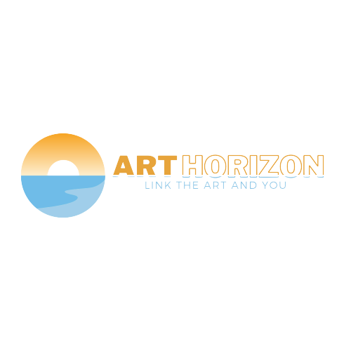

## 🎨 Art Horizon, Link The Art and You

> 일반인의 미술 진입 장벽을 낮추고 많은 화가들이 자신들의 작품을 많은 사람들에게 보여줄 수 있는 인터넷 미술 관람 서비스

  

## 📜 기획 배경

- 미술에 관심이 생겼는데 **입문하기 어려운 사람들**
  - 쉽고 여유롭게 볼 수 있는 관람 환경을 제공
- 미술관에 그림을 전시하는 것이 어려운 **신인 작가**들
  - 일반인들에게 간단하게 자신들의 작품을 제공할 수 있는 플랫폼을 제공
  - 관람을 하다가 그림을 구매할 수 있는 **비즈니스 모델** 제공

  

## 🗓 개발 기간

- 2022.08.22 ~ 2022.10.07

  

## 💡 주요 기능

- 등록된 작품을 볼 수 있는 **작품 목록**/ 검색을 통해 필터링된 작품 목록 제공
- 작품에 대한 정보를 볼 수 있는 **상세 페이지**, 클릭을 통해 큰 화면으로 볼 수 있는 **감상 모드**
- 북마크한 작품이나 본인이 등록한 작품들을 한 번에 볼 수 있는 **마이 페이지**
- 미술에 흥미를 높일 수 있는 AI 기반 서비스 **AI style**과 **그림의 향**

  

## 🛠 기술 스택

### ✔A.I 

| 라이브러리 명 | 설명                                                         |
| ------------- | ------------------------------------------------------------ |
| pytorch       | 연구 프로토타이핑에서 프로덕션 배포까지의 경로를 가속화하는 오픈 소스 머신 러닝 프레임워크 |
| opencv        | 실시간 컴퓨터 비전을 목적으로 한 프로그래밍 라이브러리       |

### ✔B.E

| 라이브러리 명 | 설명                                                         |
| ------------- | ------------------------------------------------------------ |
| Spring boot   | 기본 Spring 프레임워크에 톰캣 서버를 내장하고 여러 편의 기능들을 추가한 자바 웹 프레임워크 |
| JWT           | 클라이언드와 서버, 서비스와 서비스 사이의 통신 시 권한 인가를 위해 사용하는 토큰 |
| Lombok        | 어노테이션을 제공해 메서드 작성 코드를 줄여주는 라이브러리   |
| Swagger       | REST API를 설계, 빌드, 문서화 및 사용하는데 도움이 되는 OpenAPI사양을 중심으로 구축된 오픈 소스 라이브러리 |

### ✔F.E

| 라이브러리 명    | 설명                                                         |
| ---------------- | ------------------------------------------------------------ |
| aos              | 스크롤하면 애니메이션 효과와 함께 표시하는 라이브러리        |
| axios            | 브라우저와 node.js에서 사용할 수 있는 Promise 기반 HTTP 클라이언트 라이브러리 |
| react-router-dom | react에서 SPA를 사용할 수 있게 해주는 라이브러리             |
| react-icons      | ES6 imports를 사용해 React 프로젝트에 인기 있는 아이콘들을 쉽게 사용할 수 있는 라이브러리 |
| redux-toolkit    | Redux을 더 쉽게 사용하기 위한 라이브러리                     |
| react-toastify   | 프로젝트 앱 내에서 쉽게 알림을 제공해주는 라이브러리         |
| tailwindcss      | 디자인 시스템을 위한 API                                     |

### ✔ Server

### ✔DB

 

  

## 🧑🏻‍🤝‍🧑🏻 멤버

**TEAM MEDICI**

|||||||
|:---:|:---:|:---:|:---:|:---:|:---:|
|우영택|손승운|박자연|이주영|함희주|한재혁|
|AI 개발자  AI style 개발|AI 개발자 Tags 개발|B.E 개발자 DB 설계|B.E 개발자  배포 담당|F.E 개발자  UX / UI|F.E 개발자 팀장|

  

## 🔗 추가 내용

- [Art Horizon by Team Medici](https://www.notion.so/Art-Horizon-d302eafedebd41739669948d252c5567)

